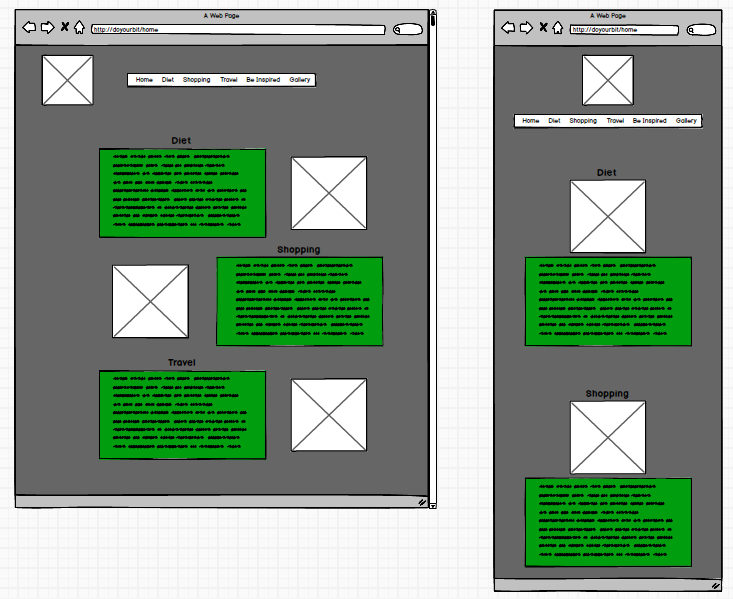
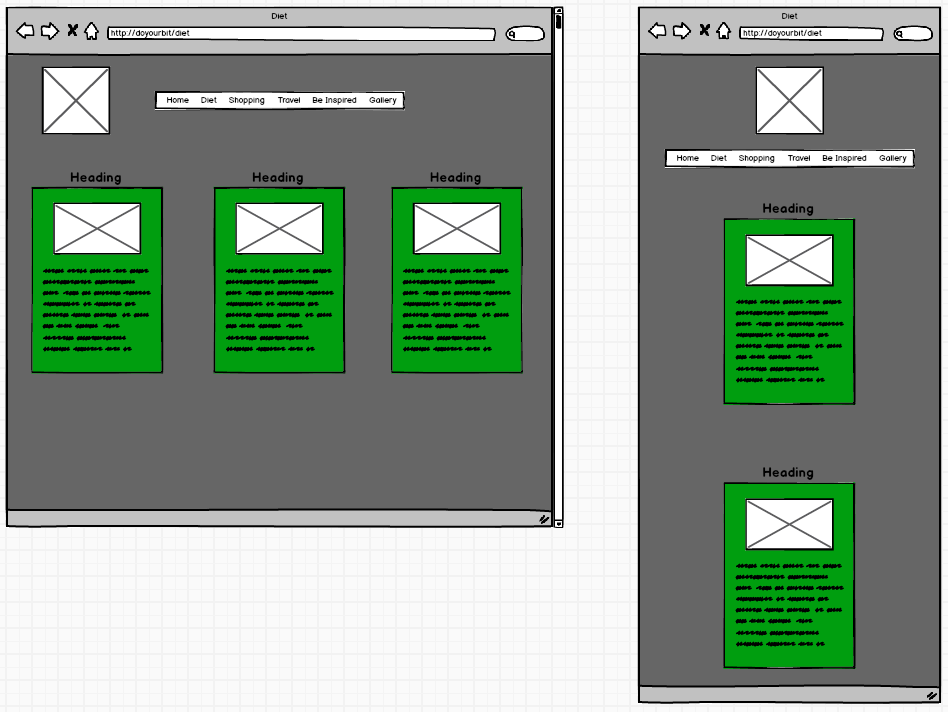
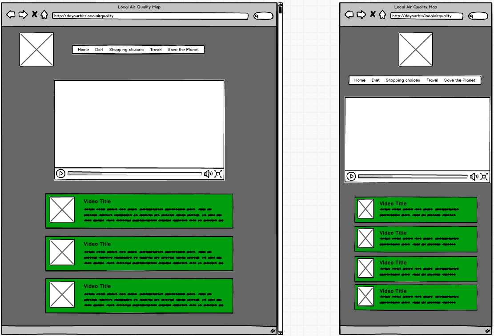
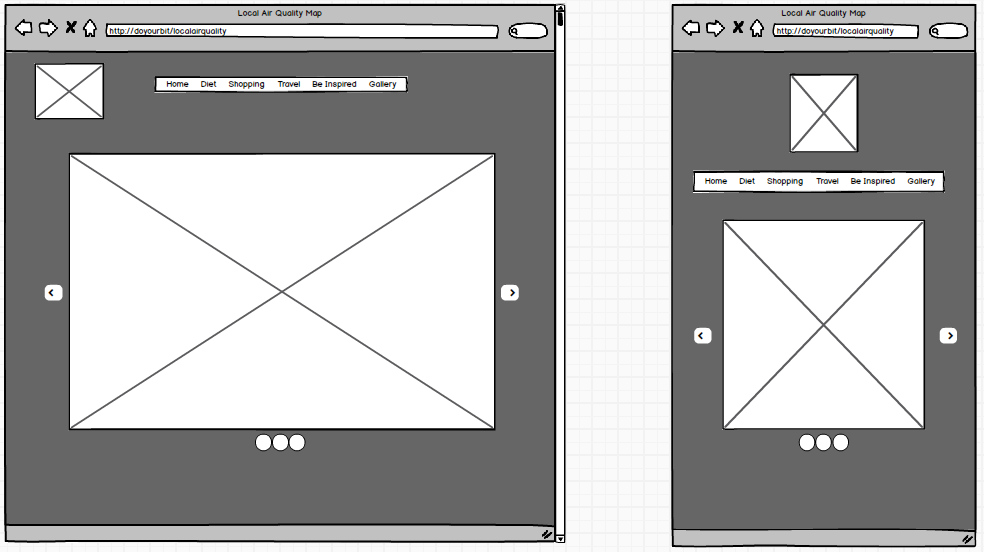
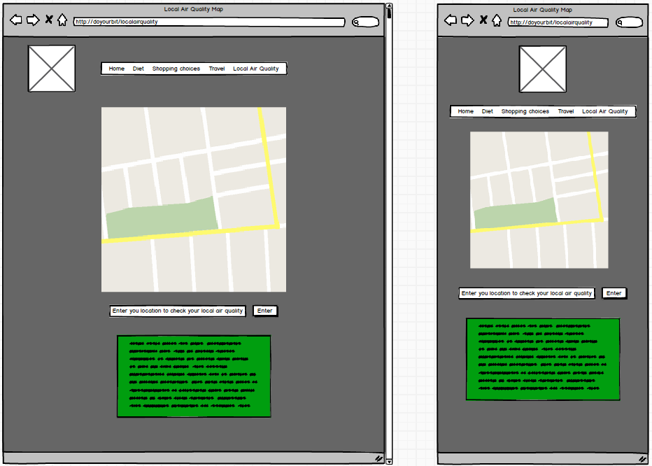
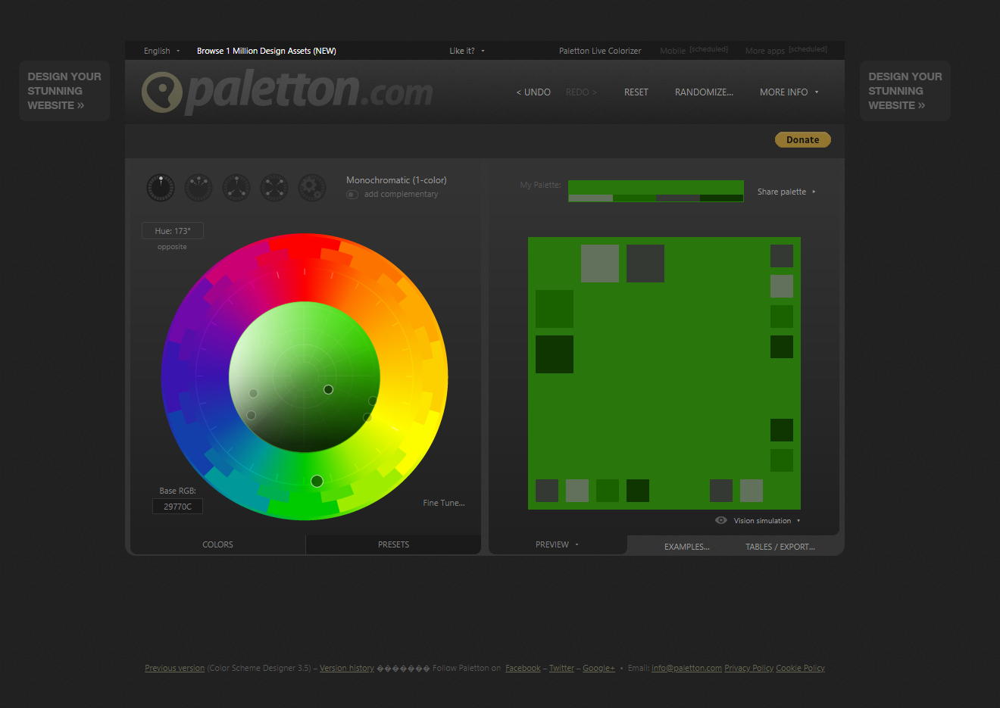
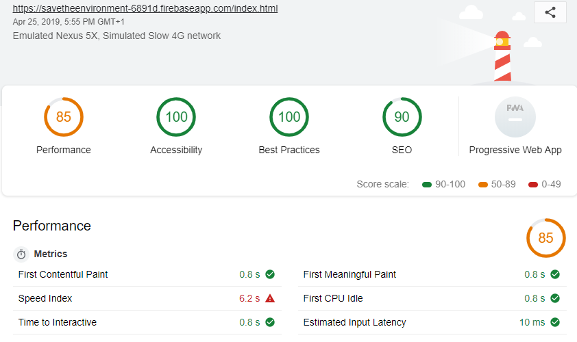
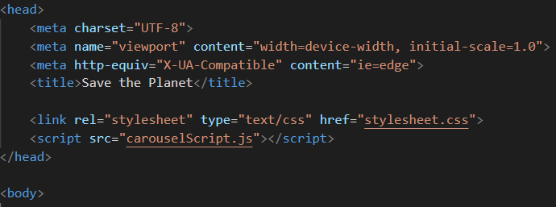
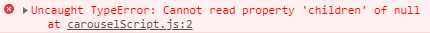
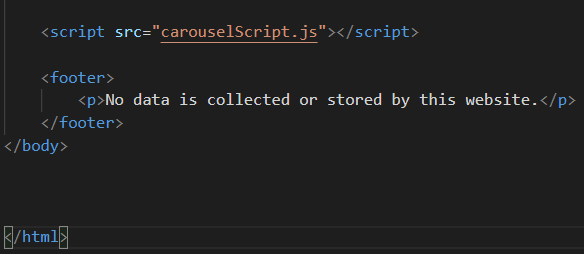

# Assignment1

# The problem to be solved
The aim of this website is to let people know about some of the changes that people can make in their lives which can decrease our negative impact on the environment. These changes can be small, and others may require more planning and commitment, however awareness is better than ignorance.

# Wire Frames
## Home Page

The aim of the home page is to summarise what the website is about and to give an insight into what a person might expect of the website. I tried to go with a clean design using articles with relevant, stylish images. The use of fewer assets is important in keeping the attention on the content for the user to read through. For the mobile design I stacked the assets to make it easily readable on mobile.

## Diet, Shopping and Travel Pages

These diet, shopping and travel pages are identical in design and only vary in content. The aim for these pages was to highlight 3 main points within their topic. Having 3 articles beside each other in the middle of the page means the user has easy access to the content. These articles are also easy to convert into a mobile format by stacking them.

## Be Inspired Page

The aim of this page is to present videos that are informative and enlightening, giving the user ways they can help and why they should try to help save the environment by changing small things in their lifestyle to help their personal impact on the environment.

This page will preview a large video at the top and display the other videos below which are taken from a playlist on YouTube using the YouTube api. The user will be able to select one of the videos from the list below which will display that video at the top where the user can then watch it.

## Gallery Page

The gallery page is here to display some images of the global endangered environments and animals to show the user what we are trying to save. This page is very simple and contains a carousel made in JavaScript to display these pictures.

## Local Air Quality

The purpose of this page would have been for the user to search a location which would return a result on the map showing the air quality for that location. This page did not make the final website due to some restrictions such as a limited number of air quality stations for readings.

# Colour Choices

I knew that I wanted the colour green in the project because naturally the environment is associated with the colour green. I also wanted to mix shades the main colour, so black, greys and white. The reason for this is that I found no other colours that worked well with the base colour of green and I didn’t want to take any attention away from it. 

# Accessibility Standards
Most of the accessibility standards have been met by this website. Alternative text for images is available and describe what the image contains. This is used by people that have little to no vision. Another standard that has been met is audio transcript. All of the videos on this site are imported from the YouTube api which means they all have subtitles, and some have subtitles in multiple languages. One accessibility standard that is not entirely implemented is the ability to use the keyboard to access the whole website. The majority of the website is functional by using the keyboard with the exception being the selection of YouTube videos from the ‘be inspired’ page.
# GDPR
The website I have created does not contain any way of taking, collecting or storing data from anyone that visits the website. This website conforms to the GDPR (General Data Protection Act) as it is not a collector nor a processor of data. 
# Distance Selling
As the aim of this website is to raise awareness of potential differences we can make to the environment and there is no selling of goods, this website conforms to the online and distant selling act.
# Evaluation
## The Problem
The problem that I wanted to address was the environment and ways which we as individuals can make changes to our lifestyles and choices to make a difference to our negative impact on the environment. I am pleased with the outcome, however there are some changes I think I could make which would positively change the way the website looks and feels. There were also a few changes I made to the site between the design and development stages.
## Design Choices
There were some design choices that changed before and during the development of the website, one of which was the exclusion of the local air quality map. There were a few reasons for this being excluded, one of those being the available APIs for this map. One of the APIs was called “Breezometer” and it required me to work for a company in order to sign up for an api key to use it and the other was called “AirVisual API”. The issue with “AirVisual API” was that it didn’t have as many stations to take air quality measurements which meant if the user didn’t live in a major city then they were likely unable to find their local air quality. 

To replace the local air quality map, I decided to use the YouTube api to create a page which displays videos that are informative about the environment or videos that are there to inspire people and to make them want to care more about their impact on the environment.

Some things I think would improve the looks of the website would be to add an opaque grey background to the navigation bar similar to the background on the articles to make the text stand out. Additionally, the nav bar could be improved by being hidden behind a button which when pressed reveals the navigation bar.

I decided ultimately to avoid using plain colours for the website and went with using an image as a background. I personally feel like it gives the website some depth and overall improves the visual quality.

The round images and rounded corners on the articles were inspired by Google’s design where their apps and operating system (Android) use rounded corners on their assets.

Performance of the website is another area I think could be improved. Currently it can take between 2-3 seconds before some of the pages fully load all of the images. I believe that converting the images from a PNG file to a JPEG would reduce the loading times to a more reasonable time.

## Accessibility
One thing I would implement to improve the website would be to allow the YouTube videos to be selectable for users using their keyboard as their primary input. This would improve the amount of accessibility options for the website.
## Testing and Findings
For testing I used the developer tools implemented in Google Chrome as they allow the screen size to be changed so that different break points can be tested. The developer tools also allow assets to be altered live which allow the developer to tinker with the styling of the website without changing the code in the file.
One thing I found when going between devices was when switching from my home PC to my laptop or the university PCs. My home PC has a higher resolution display than the other two PCs. This is when I realised that for most desktops 1920 x 1080 pixels was the most common display resolution for PCs and laptops. This is why I have created a breakpoint for a max width of 1920 pixels.
When developing the mobile version of the website at width of 600 pixels I found that the background image didn’t fully cover the page. The way I fixed this was by making the ‘background-attachment: fixed;’.
### Google Lighthouse
Below is the report for the index page using Google Lighthouse. Which shows good accessibility, best practices and SEO. Speed is the lowest marked and this is because of the image resolutions and file types. They are high resolution and png which sacrifices performance for image quality.

Below is the report for the diet page using Google Lighthouse. Which shows good performance, accessibility, best practices and SEO.

Below is the report for the eco videos page using Google Lighthouse. Which shows good performance and SEO. Accessibility is low due to the lack of full keyboard navigation and because when the iframe is written in the javascript file it doesn't have a title which is needed for screen readers.

## Problems During Development
The most challenging problem was developing the JavaScript for the ‘gallery’ page as the errors and the implementation of the api were new to me. After researching the issues, I found the mistakes that I had made which were usually related to the order in which the code was trying to execute or due to putting in a keyword where it doesn’t belong. An example of this is that I originally Imported the JavaScript file before the contents of the html file were laid out resulting in the JavaScript being unable to identify assets to manipulate with the functions in the file.

Below is the javascript file for the carousel in the head of the gallery page which results in the buttons and the navigation bar having no functionality. 

Below is the error in the console when the page loads and the javascript has been imported in the head before the document loads. The script can't find elements in the file because they haven't loaded before the script has.

Below is the the file for the carousel at the end of the body in the gallery page which means the navigation bar and buttons function as intended.

